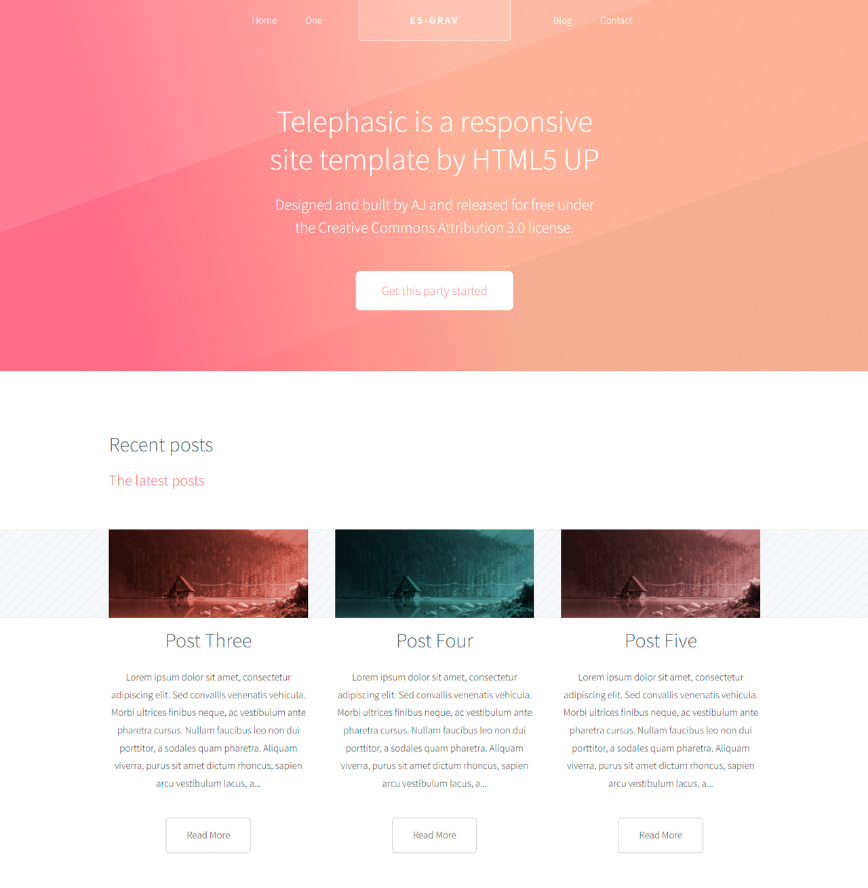

# Telephasic Theme for Grav



Telephasic by [HTML5UP](http://www.html5up.net), a responsive website template built with standards-compliant HTML and CSS. Includes HTML files, stylesheets, all supporting image and JS assets, and optional Sass sources.

The theme from HTML5Up.net is free for personal and commercial use under the [CCA 3.0 license](https://html5up.net/license).

# Features

* HTML5 and CSS3
* Fully Responsive
* Various templates for presenting your content
* Blog template added
* Featured content in sidebar
* Styling for all basic page elements
* Styling for various modules
* Cross browser compatible
* Avatar option for blog items
* Lazy loading for images in twig templates
* CSS Styles added over the original theme.

## Default Options

Telephasic comes with a few default options that can be set site-wide.  These options are:

```yaml
production-mode:              # In production mode, only minified CSS is used. When disabled, nested CSS are enabled
favicon:                      # Choosse your own favicon
logo:                         # A custom logo rather than the default (see below)  
themeSlogan:                  # Custom text for slogan
blog-page: '/blog'            # The route to the blog listing page, useful for a blog style layout
featuredposts:                # Enable/Disable featured posts in right sidebar
featuredposts_category:       # Select category name for featured posts (configured in taxonomies)
featuredposts_number:         # The number of featured posts will be displayed on the right sidebar
hero_title:                   # Title for hero section in Homepage
hero_subtitle:                # Subtitle for hero section in Homepage
hero_button_text:             # Button text for hero section in Homepage
hero_button_url:              # Button URL for hero section in Homepage
contact_enabled:              # Enable/Disable contact form in Homepage
contact_title:                # Title for contact form in Homepage
contact_subtitle:             # Subtitle for contact form in Homepage
copyright_author:             # Copyright author information for contact form in Homepage
copyright_rights:             # Copyright text for contact form in Homepage
social_enabled:               # Enable/Disable social icons in footer
```
To make modifications, you can copy the `user/themes/telephasic/editorial.yaml` file to `user/config/themes/` folder and modify, or you can use the admin plugin.

> NOTE: Do not modify the `user/themes/telephasic/telephasic.yaml` file directly or your changes will be lost with any updates

## Custom Logos

To add a custom logo, you should put the log into the `user/themes/telephasic/images/logo` folder.  Standard image formats are support (`.png`,`.jpg`, `.gif`, `.svg`, etc.).  Then reference the logo via the YAML like so:

```yaml
custom_logo:
    - name: 'my-custom-logo.png'
custom_logo_mobile:
    - name: 'my-custom-mobile-logo.png'    
```
Alternatively, you can you use the drag-n-drop "Custom Logo" field in the Telephasic theme options.

# Installation

Installing the Telephasic theme can be done in one of two ways. Our GPM (Grav Package Manager) installation method enables you to quickly and easily install the theme with a simple terminal command, while the manual method enables you to do so via a zip file.

The theme by itself is useful, but you may have an easier time getting up and running by installing a skeleton.


## GPM Installation (Preferred)

The simplest way to install this theme is via the [Grav Package Manager (GPM)](http://learn.getgrav.org/advanced/grav-gpm) through your system's Terminal (also called the command line).  From the root of your Grav install type:

    bin/gpm install telephasic

This will install the Telephasic theme into your `/user/themes` directory within Grav. Its files can be found under `/your/site/grav/user/themes/telephasic`.

## Manual Installation

To install this theme, just download the zip version of this repository and unzip it under `/your/site/grav/user/themes`. Then, rename the folder to `telephasic`. You can find these files either on [GitHub](https://github.com/pmoreno-rodriguez/grav-theme-telephasic) or via [GetGrav.org](http://getgrav.org/downloads/themes).

You should now have all the theme files under

    /your/site/grav/user/themes/telephasic

>> NOTE: This theme is a modular component for Grav which requires the [Grav](http://github.com/getgrav/grav), [Error](https://github.com/getgrav/gravplugin-error) and [Problems](https://github.com/getgrav/grav-plugin-problems) plugins.

# Updating

As development for the Telephasic theme continues, new versions may become available that add additional features and functionality, improve compatibility with newer Grav releases, and generally provide a better user experience. Updating Telephasic is easy, and can be done through Grav's GPM system, as well as manually.

## GPM Update (Preferred)

The simplest way to update this theme is via the [Grav Package Manager (GPM)](http://learn.getgrav.org/advanced/grav-gpm). You can do this with this by navigating to the root directory of your Grav install using your system's Terminal (also called command line) and typing the following:

    bin/gpm update telephasic

This command will check your Grav install to see if your Telephasic theme is due for an update. If a newer release is found, you will be asked whether or not you wish to update. To continue, type `y` and hit enter. The theme will automatically update and clear Grav's cache.

## Manual Update

Manually updating Telephasic is pretty simple. Here is what you will need to do to get this done:

* Delete the `your/site/user/themes/telephasic` directory.
* Download the new version of the Telephasic theme from either [GitHub](https://github.com/pmoreno-rodriguez/grav-theme-telephasic) or [GetGrav.org](http://getgrav.org/downloads/themes).
* Unzip the zip file in `your/site/user/themes` and rename the resulting folder to `telephasic`.
* Clear the Grav cache. The simplest way to do this is by going to the root Grav directory in terminal and typing `bin/grav clear-cache`.

> Note: Any changes you have made to any of the files listed under this directory will also be removed and replaced by the new set. Any files located elsewhere (for example a YAML settings file placed in `user/config/themes`) will remain intact.

# Setup

If you want to set Telephasic as the default theme, you can do so by following these steps:

* Navigate to `/your/site/grav/user/config`.
* Open the **system.yaml** file.
* Change the `theme:` setting to `theme: telephasic`.
* Save your changes.
* Clear the Grav cache. The simplest way to do this is by going to the root Grav directory in Terminal and typing `bin/grav clear-cache`.

Once this is done, you should be able to see the new theme on the frontend. Keep in mind any customizations made to the previous theme will not be reflected as all of the theme and templating information is now being pulled from the **telephasic** folder.

# Contact Form Configuration
For contact form configuration instructions please refer to [official documentation](http://learn.getgrav.org/forms/forms/example-form). Make sure you installed Email and Form plugin though.

# Demo page

[http://telephasic.juanvillen.es/](http://telephasic.juanvillen.es/)

# To Do

* Add Webp option in twig templates with images.
* Implement Logo Option to Header (in progress)
